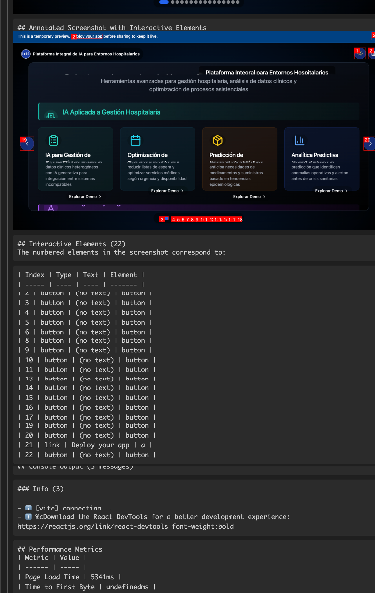
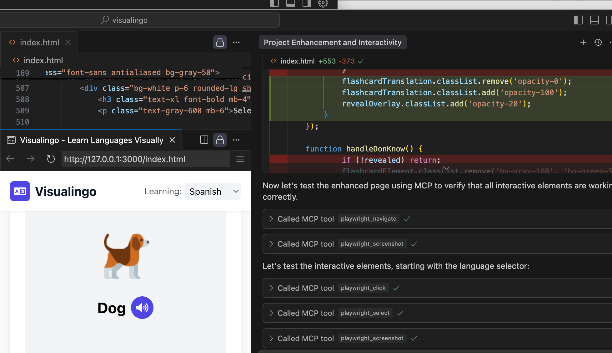

# Visual UI Debug Agent MCP

[](https://github.com/samihalawa/visual-ui-debug-agent-mcp) [](https://github.com/samihalawa/visual-ui-debug-agent-mcp) [](https://smithery.ai/docs/config)

An autonomous debugging MCP server that empowers AI models to analyze, debug, and interact with web interfaces through Playwright. This server enables any AI model (even those without built-in vision capabilities) to visually inspect web pages, find UI bugs, test user workflows, and validate application performance - all without human intervention.



## Autonomous UI Debugging Agent

This MCP server functions as an AI-powered autonomous debugging agent that can:

- **Perform comprehensive visual analysis** of web applications
- **Detect UI issues** by inspecting visual elements and their properties
- **Automatically test common user workflows** without manual test script creation
- **Validate API endpoints** and verify backend responses
- **Track visual changes** between application versions
- **Monitor console logs** for errors and warnings
- **Analyze performance metrics** to identify bottlenecks
- **Generate detailed reports** with screenshots and recommendations

The server is designed to work intelligently, reusing browser sessions, avoiding unnecessary file creation, and focusing on the most important aspects of your application.

## Installation Options

### Using an MCP Gateway (Recommended)

The easiest way to install this MCP server is through any MCP-compatible gateway:

```bash
# Example with Claude gateway
claude-gateway install visual-ui-debug-agent-mcp
```

### Quick Installation Script

Use our one-line installation script:

```bash
curl -s https://raw.githubusercontent.com/samihalawa/visual-ui-debug-agent-mcp/main/scripts/install-global.sh | bash
```

### NPM Installation

For global installation via npm:

```bash
# Install globally
npm install -g visual-ui-debug-agent-mcp

# Start the server
visual-ui-debug-agent-mcp
```

### Docker Hub Installation

For containerized deployment:

```bash
# Pull the image from Docker Hub
docker pull samihalawa/visual-ui-debug-agent-mcp:latest

# Run the container
docker run -p 8080:8080 samihalawa/visual-ui-debug-agent-mcp:latest
```

### Smithery Integration

This package is fully Smithery-compatible using the included configuration file:

```bash
# Install with Smithery
smithery install visual-ui-debug-agent-mcp

# Or run with your API key
npm run smithery:key YOUR_SMITHERY_API_KEY
```

For full installation and usage instructions, see the [Smithery Integration Guide](./SMITHERY-GUIDE.md).

## Complete Tool Reference

### Primary Visual Analysis Tools

#### 1. `enhanced_page_analyzer` 🔍

Provides comprehensive analysis of web pages with interactive elements mapping, performance metrics, and visual inspection.

```javascript
const analysis = await mcp.callTool("enhanced_page_analyzer", {
  url: "https://example.com/dashboard",
  includeConsole: true,
  mapElements: true,
  fullPage: true
});
```

#### 2. `ui_workflow_validator` 🔄

Automatically tests full user journeys by executing and validating a sequence of UI interactions.

```javascript
const result = await mcp.callTool("ui_workflow_validator", {
  startUrl: "https://example.com/login",
  taskDescription: "User login flow",
  steps: [
    { description: "Enter username", action: "fill", selector: "#username", value: "test" },
    { description: "Enter password", action: "fill", selector: "#password", value: "pass" },
    { description: "Click login", action: "click", selector: "button[type='submit']" },
    { description: "Verify dashboard loads", action: "verifyElementVisible", selector: ".dashboard" }
  ],
  captureScreenshots: "all"
});
```

#### 3. `visual_comparison` 👁️

Compares two web pages or UI states to identify visual differences.

```javascript
const diff = await mcp.callTool("visual_comparison", {
  url1: "https://example.com/before",
  url2: "https://example.com/after",
  threshold: 0.05
});
```

#### 4. `screenshot_url` 📸

Captures high-quality screenshots of any URL with options for full page or specific elements.

```javascript
const screenshot = await mcp.callTool("screenshot_url", {
  url: "https://example.com/profile",
  fullPage: true,
  device: "iPhone 13"
});
```

#### 5. `batch_screenshot_urls` 📷

Takes screenshots of multiple URLs in a single operation for efficient comparison.

```javascript
const screenshots = await mcp.callTool("batch_screenshot_urls", {
  urls: ["https://example.com/page1", "https://example.com/page2"],
  fullPage: true
});
```

### User Flow Testing Tools

#### 6. `navigation_flow_validator` 🧭

Tests multi-step navigation sequences with validation.

```javascript
const navResult = await mcp.callTool("navigation_flow_validator", {
  startUrl: "https://example.com",
  steps: [
    { action: "click", selector: "a.products" },
    { action: "wait", waitTime: 1000 },
    { action: "click", selector: ".product-item" }
  ],
  captureScreenshots: true
});
```

#### 7. `api_endpoint_tester` 🔌

Tests multiple API endpoints and verifies responses for backend validation.

```javascript
const apiTest = await mcp.callTool("api_endpoint_tester", {
  url: "https://api.example.com/v1",
  endpoints: [
    { path: "/users", method: "GET" },
    { path: "/products", method: "GET" }
  ],
  authToken: "Bearer token123"
});
```

### DOM and Performance Analysis

#### 8. `dom_inspector` 🔬

Inspects DOM elements and their properties in detail.

```javascript
const elementInfo = await mcp.callTool("dom_inspector", {
  url: "https://example.com",
  selector: "nav.main-menu",
  includeChildren: true,
  includeStyles: true
});
```

#### 9. `console_monitor` 📟

Monitors and captures console logs for error detection.

```javascript
const logs = await mcp.callTool("console_monitor", {
  url: "https://example.com/app",
  filterTypes: ["error", "warning"],
  duration: 5000
});
```

#### 10. `performance_analysis` ⚡

Measures and analyzes page load performance metrics.

```javascript
const perfMetrics = await mcp.callTool("performance_analysis", {
  url: "https://example.com/dashboard",
  iterations: 3
});
```

### Low-Level Playwright Controls

#### 11. `screenshot_local_files` 📁

Takes screenshots of local HTML files.

```javascript
const localScreenshot = await mcp.callTool("screenshot_local_files", {
  filePath: "/path/to/local/file.html"
});
```

#### 12. Direct Playwright Actions

Complete set of low-level Playwright controls for precise automation:

- `playwright_navigate`: Navigate to specific URLs
- `playwright_click`: Click on elements
- `playwright_iframe_click`: Click elements inside iframes
- `playwright_fill`: Fill form fields
- `playwright_select`: Select dropdown options
- `playwright_hover`: Hover over elements
- `playwright_evaluate`: Run JavaScript in the page context
- `playwright_console_logs`: Get console logs
- `playwright_get_visible_text`: Extract visible text
- `playwright_get_visible_html`: Get visible HTML
- `playwright_go_back`: Navigate back
- `playwright_go_forward`: Navigate forward
- `playwright_press_key`: Press keyboard keys
- `playwright_drag`: Drag and drop elements
- `playwright_screenshot`: Take custom screenshots

## Autonomous Debugging Workflows

The MCP server can autonomously perform complete debugging workflows by combining tools. For example:

### Visual Regression Testing
```javascript
// 1. Analyze the current version
const currentAnalysis = await mcp.callTool("enhanced_page_analyzer", {...});

// 2. Compare with previous version
const comparisonResult = await mcp.callTool("visual_comparison", {...});

// 3. Generate visual difference report
const report = await mcp.callTool("ui_workflow_validator", {...});
```

### End-to-End User Flow Validation
```javascript
// 1. Start with login flow
const loginResult = await mcp.callTool("ui_workflow_validator", {...});

// 2. Validate core features
const featureResults = await mcp.callTool("navigation_flow_validator", {...});

// 3. Test API endpoints
const apiResults = await mcp.callTool("api_endpoint_tester", {...});
```

### Performance Optimization
```javascript
// 1. Analyze initial performance
const initialPerformance = await mcp.callTool("performance_analysis", {...});

// 2. Identify slow-loading elements
const elementPerformance = await mcp.callTool("dom_inspector", {...});

// 3. Monitor console for errors
const consoleErrors = await mcp.callTool("console_monitor", {...});
```

## Visual Analysis Examples

### Element Mapping


The MCP server automatically maps all interactive elements on a page, making it easy for an AI model to understand the UI structure.

### Visual Comparison


The visual comparison tool highlights differences between UI states, perfect for catching unexpected visual changes.

## Integration Options

### Integration with Smithery
```yaml
# smithery.yaml configuration
startCommand:
  type: stdio
  configSchema:
    type: object
    properties:
      port:
        type: number
        description: Port number for the MCP server
      debug:
        type: boolean
        description: Enable debug mode
```

### Integration with GLAMA
```json
// glama.json configuration
{
  "name": "visual-ui-debug-agent-mcp",
  "version": "1.0.2",
  "settings": {
    "port": 8080,
    "headless": true,
    "maxConcurrentSessions": 5
  }
}
```

### Integration with Non-Vision Models
The MCP server converts visual information into structured data that can be used by any AI model, even those without vision capabilities:

```javascript
// The model receives structured data about visual elements
{
  "interactiveElements": [
    {
      "tagName": "button",
      "text": "Submit",
      "bounds": {"x": 120, "y": 240, "width": 100, "height": 40},
      "visible": true
    },
    // More elements...
  ]
}
```

## CI/CD Integration

This MCP server includes GitHub Actions workflows for continuous integration and deployment:

- **Build and Test**: Validates code quality
- **NPM Publishing**: Automates package publishing
- **Docker Publishing**: Creates and pushes Docker images
- **Smithery Publishing**: Deploys to Smithery platform


## Running evals

The evals package loads an mcp client that then runs the index.ts file, so there is no need to rebuild between tests. You can load environment variables by prefixing the npx command. Full documentation can be found [here](https://www.mcpevals.io/docs).

```bash
OPENAI_API_KEY=your-key  npx mcp-eval src/evals/evals.ts src/index copy.ts
```
## License

This project is licensed under the [ISC License](LICENSE).